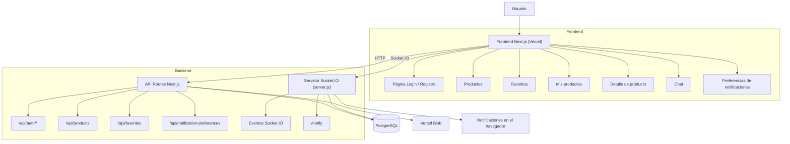
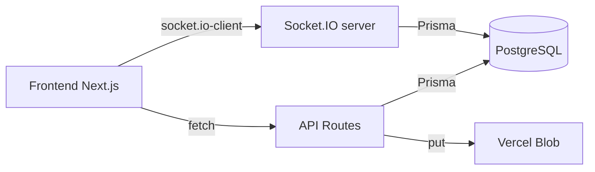
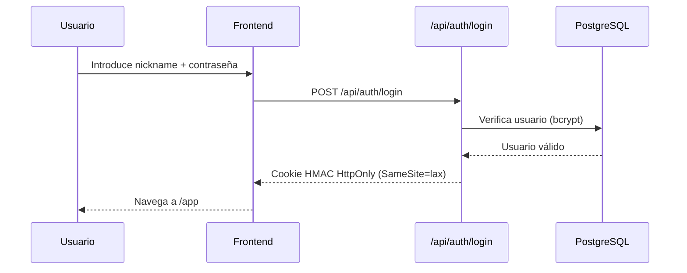
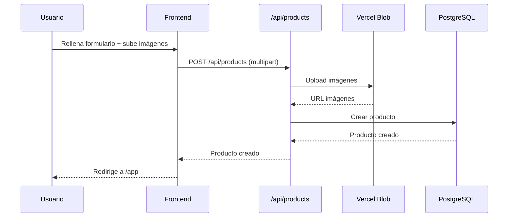
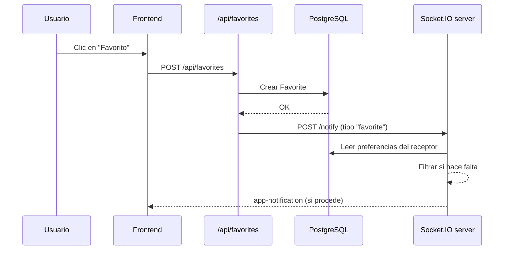
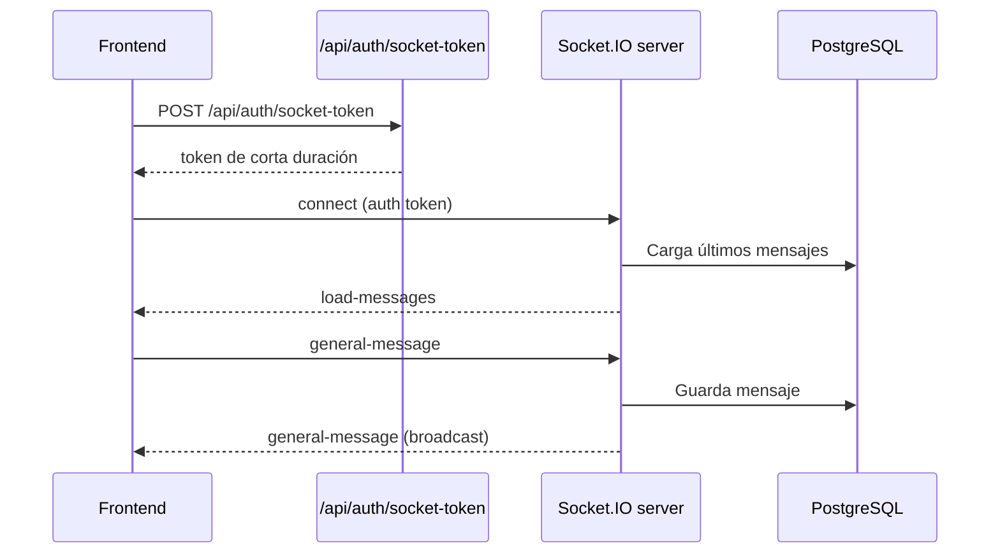
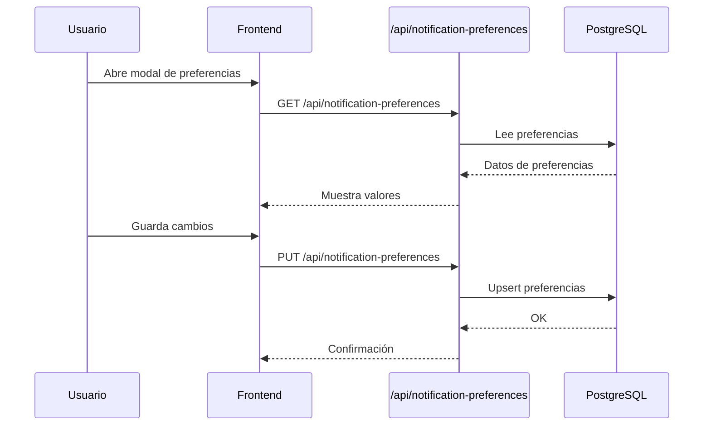

## Diagrama general

## Conexiones entre componentes

## Flujo: autenticación y entrada a la app

## Flujo: publicar producto

## Flujo: añadir a favoritos + notificación

## Flujo: chat en tiempo real

## Flujo: preferencias de notificaciones

## Notas rápidas
- El frontend y las API conviven en Next.js 15.5 (React 19); gestor **pnpm**.
- La sesión va en cookie HMAC HttpOnly; el chat pide token con **POST** `/api/auth/socket-token`.
- Socket.IO corre en `server.js` (local) o `socket-server.js` (Railway) y comparte BD con la API.
- Las notificaciones push del navegador se gestionan en el cliente (VAPID).
- Las preferencias se aplican antes de emitir notificaciones vía `/notify`.
